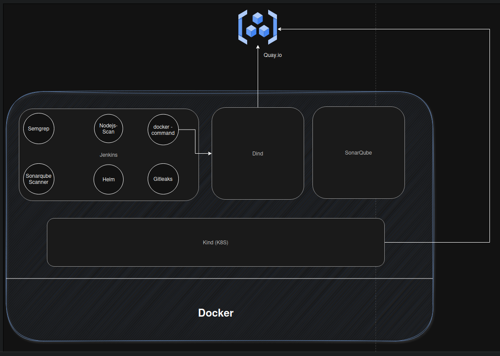

# Lab Setup

## Arch

## Docker
- https://docs.docker.com/engine/install/ubuntu/

## Jenkins
- https://www.jenkins.io/doc/book/installing/docker/

## SonarQube
- https://github.com/SonarSource/docker-sonarqube/blob/master/example-compose-files/sq-with-postgres/docker-compose.yml

## Kind
- https://kind.sigs.k8s.io/docs/user/quick-start/#installing-from-release-binaries
- https://kind.sigs.k8s.io/docs/user/quick-start/#creating-a-cluster

